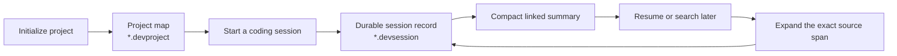

# RecCli

[](https://www.python.org/)
[](LICENSE)


**Persistent, inspectable memory for coding agents.**

RecCli ("reck-lee") helps Claude Code and Codex resume projects across sessions, recall prior decisions, and recover the source discussion behind what they remember.

Most agent memory ends at a summary. RecCli keeps the compact memory linked to the full chronological record, so an agent can move from “we chose this” to “here is where we discussed why.”

## The problem RecCli solves

On Tuesday, you and an agent make an architectural decision, fix two related bugs, and leave one edge case open. On Friday, a new session starts cold. You either re-explain the project or trust an approximate summary that cannot show its work.

With RecCli, the next session can answer:

```text
You: Why did we keep the token refresh logic separate from the auth middleware?

Agent: We kept them separate because their lifecycles and failure modes differ.
       That decision came from session 0426, messages 118–126.
       I can expand the original discussion if you want the full reasoning.
```

RecCli is built for questions such as:

- What did we decide, and why?
- What remains open from the last session?
- Have we already investigated this failure?
- Which sessions changed this file?
- How did this feature reach its current state?
- Show me the original discussion behind that memory.

If verifiable memory for coding agents is useful to you, consider [starring RecCli](https://github.com/reccli/reccli). It helps other developers discover the project.

## How it works



The workflow follows the life of the project:

1. **Initialize once.** RecCli scans the repository and builds a compact feature map linking features, files, documentation, and session history.
2. **Start oriented.** The agent loads the project map, folder tree, pinned memory, and the previous session’s open issues and next steps.
3. **Work normally.** Claude Code hooks can record prompts, responses, and tool activity automatically. Codex uses the same MCP memory tools but does not currently expose equivalent lifecycle hooks.
4. **Close the loop.** RecCli saves decisions, code changes, solved problems, open issues, and next steps as structured memory.
5. **Recall across sessions.** Hybrid search combines dense retrieval and BM25 across the project’s session history.
6. **Verify the memory.** A result can be expanded through its linked span and message range into the original chronological discussion.

The result is bounded working context without treating compaction as irreversible deletion.

## Install

RecCli currently installs from source and requires Python 3.10 or newer.

```bash
git clone https://github.com/reccli/reccli.git
cd reccli
python3 -m pip install -r requirements.txt
reccli --help
```

### Claude Code

```bash
reccli setup
```

This registers the RecCli MCP server and configures Claude Code lifecycle hooks for session start, prompt and tool recording, compaction, and session end.

### Codex

```bash
reccli setup --codex
```

This registers the MCP server in `~/.codex/config.toml` and installs a managed RecCli block in `~/AGENTS.md`. The instructions tell Codex to load project memory at startup and save structured notes when a session wraps up.

Start a new Claude Code or Codex session after setup so the integration is loaded.

## Initialize your first project

From the repository you want RecCli to remember, ask your agent:

```text
Initialize RecCli memory for this project.
```

The agent calls `project_init`, scans the codebase with Tree-sitter, and clusters the result into stable project features. If no configured LLM API is available for clustering, the MCP workflow can hand the scan back to the active agent to finish in conversation.

You can also initialize from the CLI when a provider is configured:

```bash
cd /path/to/your/project
reccli project init --description "A short description of this project"
```

RecCli’s current project-oriented layout is:

```text
your-project/
├── your-project.devproject    # Compact project and feature map
└── devsession/                # Session records, indexes, and sidecars
```

The exact project-map filename follows the repository name; this README uses `*.devproject` when referring to the format generally.

## Everyday use

Most interaction happens through the coding agent rather than by invoking tools manually.

At the start of a session:

```text
Load this project’s RecCli context before we begin.
```

While working:

```text
What did we decide about authentication retries?
Find our previous work on src/api/webhooks.py.
Did we already investigate this timeout?
Expand the source discussion behind that result.
```

Before finishing a Codex session:

```text
Save this session’s decisions, solved problems, open issues, and next steps to RecCli.
```

Claude Code’s lifecycle integration captures the session automatically; structured close-out notes are still valuable because they become the next session’s resume brief.

## Claude Code and Codex support

| Capability | Claude Code | Codex |
| --- | --- | --- |
| MCP memory tools | Yes | Yes |
| Project context at session start | Lifecycle hook | Managed `AGENTS.md` instruction |
| Automatic prompt and tool recording | Yes | No equivalent lifecycle hooks currently |
| Cross-session search and expansion | Yes | Yes |
| Structured session close-out | Hook-assisted and agent-callable | Agent calls `save_session_notes` |
| Full `.devsession` source record | Automatic through hooks | Depends on explicitly captured session data |

## Core memory tools

| Tool | Purpose |
| --- | --- |
| `project_init` | Scan a codebase and create its project feature map |
| `load_project_context` | Load the feature map, folder tree, pinned memory, and resume brief |
| `save_session_notes` | Persist decisions, changes, solved problems, open issues, and next steps |
| `search_history` | Run hybrid search across prior sessions |
| `search_by_file` | Find session history connected to a file |
| `search_by_time` | Recall work from a particular time range |
| `expand_search_result` | Recover the source conversation behind a search hit |
| `list_sessions` | Inspect the recorded session catalog |
| `recover_file` | Recover historical file content from captured tool artifacts |
| `pin_memory` | Keep an important memory visible at every session start |
| `doctor` | Detect missing summaries, stale indexes, and broken memory links |

## The memory model

RecCli uses two required session-memory layers plus an optional project layer.

### Full conversation: source of truth

Each `.devsession` preserves the chronological record with stable message identifiers. Claude Code recording also retains terminal and tool activity, including full tool responses when needed for reconstruction.

### Session summary: bounded working memory

The compact summary organizes what matters into five categories:

- decisions
- code changes
- problems solved
- open issues
- next steps

Each item can carry semantic span IDs, key evidence references, and an exact message range. The summary is an index into the record, not a replacement for it.

### Project map: cross-session orientation

The `*.devproject` file connects features to files, documents, and sessions. It gives an agent a compact view of the repository before it retrieves deeper session history. The `.devsession` format remains useful independently, while RecCli’s project-context MCP workflow expects a project map created by `project_init`.

### Retrieval: an accelerator, not the memory

Dense embeddings and BM25 help locate likely evidence across many sessions. Vectors are approximate and replaceable; the conversation, spans, and summaries remain the inspectable canonical data.

## Standalone CLI

RecCli also exposes direct commands for inspecting and managing memory:

```bash
reccli project show
reccli list
reccli search "auth middleware decision"
reccli expand <result-id>
reccli browse
reccli doctor
```

Run `reccli --help` for the complete command surface.

## Local data and privacy

RecCli is local-first: project memory is stored in `*.devproject`, `devsession/`, and local configuration rather than a hosted RecCli account.

Session records can contain source code, conversation text, tool responses, file snapshots, and other sensitive material. Keep them out of Git unless you deliberately want to share them:

```gitignore
*.devproject
devsession/
```

The standalone provider configuration reads `ANTHROPIC_API_KEY` and `OPENAI_API_KEY` from the environment first. Keys saved through `reccli config` are currently stored as plaintext JSON under `~/reccli/config.json`; system-keychain storage is not implemented yet.

Configured model and embedding providers may receive the text required for summarization, clustering, or retrieval. Local-first storage should not be interpreted as “no external model calls.”

## Project status

RecCli is a **developer preview** at version `0.9.0`.

The session format, recording, summarization, hybrid retrieval, linked expansion, project mapping, and MCP integrations are implemented and actively dogfooded. Packaging and end-to-end onboarding are still being polished, so the supported installation path is currently a source checkout.

The coding-continuity benchmark is still a design draft. Claims in this README describe the implemented memory model and intended workflow, not published comparative performance results.

## Documentation

- [Documentation index](docs/README.md)
- [`.devsession` format specification](docs/specs/DEVSESSION_FORMAT.md)
- [`*.devproject` format specification](docs/specs/DEVPROJECT_FORMAT.md)
- [Context loading architecture](docs/architecture/CONTEXT_LOADING.md)
- [Retrieval implementation](docs/implementation/retrieval/README.md)
- [Settings and authentication](docs/reference/SETTINGS_AND_AUTH.md)
- [API-key security](docs/reference/API_KEY_SECURITY.md)

## Contributing

Issues and pull requests are welcome. When proposing memory-format changes, preserve the core authority model: full conversation records what happened, summaries provide bounded recall, and the project map organizes work across sessions.

## License

RecCli is released under the [MIT License](LICENSE). The `.devsession` format specification is released under CC0 so other tools can implement it freely.
